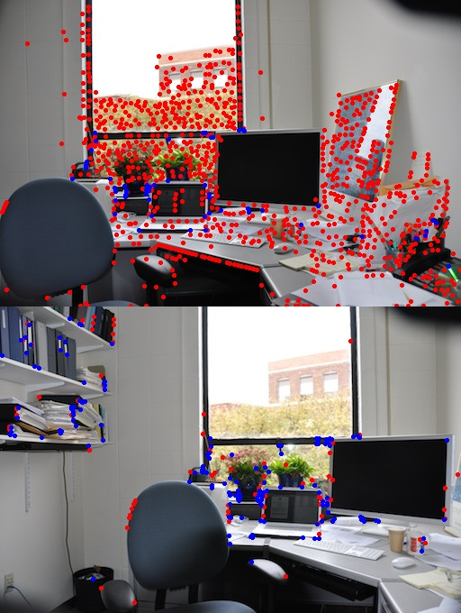
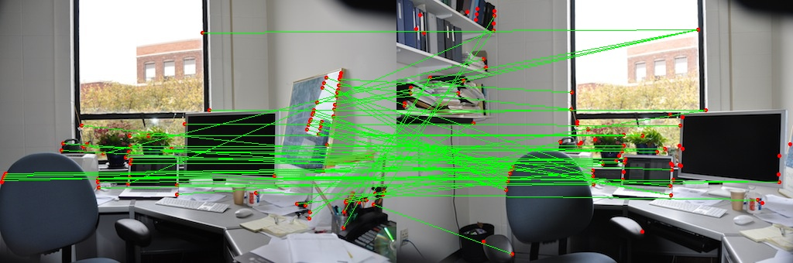
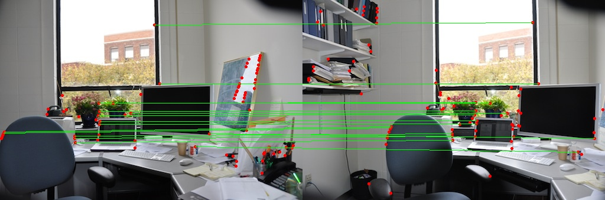
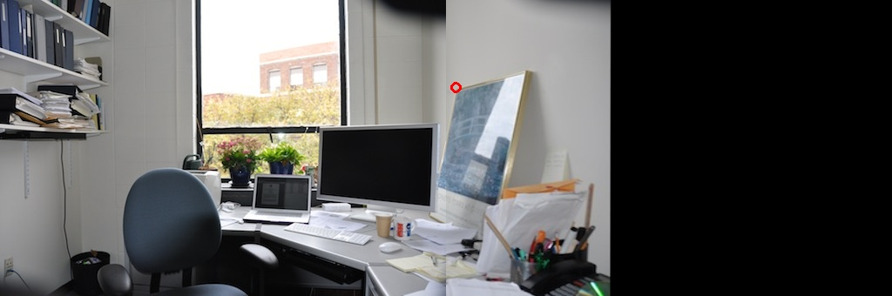
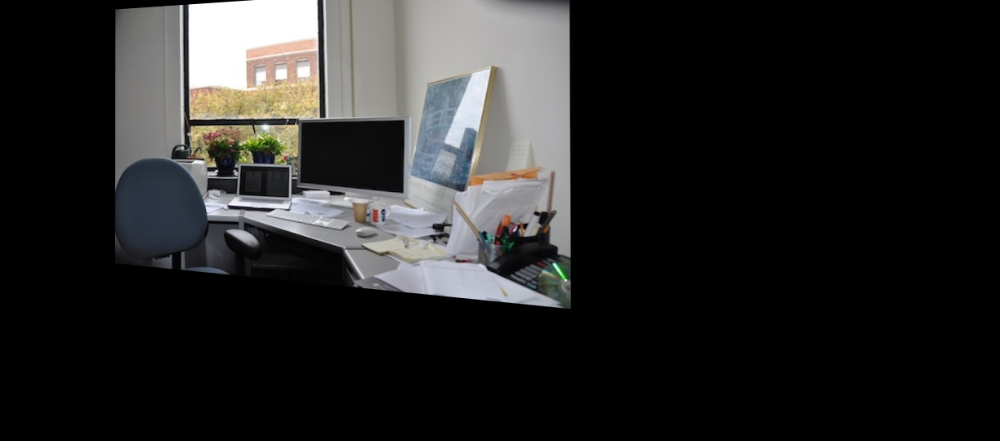

This repo was submitted as a partial requirement of computer vision course. It contains the implementation of following algorithms for Image Mosacing and corner detection.
Here we applied a Harris corner detector to find corners in two images, automatically find corresponding features, estimate a homography between the two images, and
warp one image into the coordinate system of the second one to produce a mosaic containing the union of all pixels in the two images.
The follwing was the flow of this project.
- Read two images and apply Harris Corner detection algorithm on them.
- Perform Non- max suppression of those corner points to find the best corners in the image.
- Perform Normalised Cross Corelation between the corner points of two images to find thei correspondences\.
- These correspondences will definetly have some outlier, reomve those by applying RANSAC algoirthm.
- Find the homography between the remaining inliers.
- Wrap one image ontop another by applying the homography we found in the above step.
- Performed blending algorithms like Alpha Blending, Weighted average blending, average Blending, Linear Blending.

Output:

